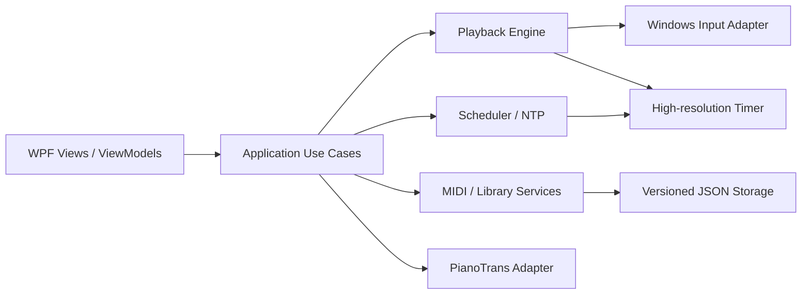

# MeowField AutoPlay Lite Windows 重构方案

> 状态：设计基线  
> 目标平台：Windows 10/11 x64  
> 核心约束：现有已完成功能不得缺失；新版本达到功能等价验收前，旧版本继续可构建、可运行。

## 1. 重构目标

本次重构不是简单换皮，而是把当前 Electron + React + Python + WebSocket 的多进程结构，迁移为 Windows 原生的单进程桌面应用。目标是：

- 降低安装体积、启动耗时、内存占用和多进程故障点。
- 提升播放计时稳定性、窗口绑定可靠性和 Windows 10 兼容性。
- 将超大前端组件拆分为可测试的业务模块。
- 按 `isoumao` 的视觉语言重做 UI，而不是照搬网页布局。
- 保持现有配置、曲库、预设、映射和播放行为可迁移。
- 为后续 MIDI 编辑器等新功能预留扩展边界，但不把未完成占位功能计入本次等价范围。

## 2. 技术选型

### 2.1 推荐栈

| 层级 | 选型 | 说明 |
| --- | --- | --- |
| 运行时 | .NET 10 LTS | Windows-only，长期支持，性能和部署能力成熟 |
| 桌面 UI | WPF | Win32 互操作成熟，适合高密度桌面工具和自定义主题 |
| 架构 | MVVM + Use Case/Service | UI 状态、业务规则、Win32 调用相互隔离 |
| MVVM | CommunityToolkit.Mvvm | 轻量，减少样板代码 |
| 宿主与依赖注入 | Microsoft.Extensions.Hosting/DI | 统一服务生命周期、配置和日志 |
| MIDI | Melanchall.DryWetMidi | 解析、时序、TempoMap 等能力成熟，避免自研解析器 |
| 日志 | Microsoft.Extensions.Logging + Serilog | 结构化日志、滚动文件、故障导出 |
| 序列化 | System.Text.Json | 版本化配置和兼容迁移 |
| 图标 | Lucide.Wpf | 与参考设计一致的线性图标体系 |
| 测试 | xUnit + FluentAssertions | 单元、集成和回归测试 |
| UI 自动化 | FlaUI 或 Appium/WinAppDriver | Windows 真实工作流验收 |

不建议引入完整的 MahApps、MaterialDesign 等视觉框架。它们会带来较强的默认风格和额外依赖，本项目只需要原生 WPF ControlTemplate、ResourceDictionary 和少量行为组件。

### 2.2 部署策略

- 首发目标：`win-x64`，Windows 10 22H2 与 Windows 11 作为正式验收环境。
- 默认产物：self-contained 发布，不要求用户预装 .NET。
- 安装形式：先提供便携 ZIP；稳定后补充 MSIX 或签名安装包。
- 不开启激进裁剪；WPF 反射和资源字典在未完整验证前不使用 Trim。
- 播放器主程序保持单进程；音频转谱工具仍按现有能力作为受控外部进程启动。
- 发布前进行代码签名，并验证管理员启动、SmartScreen、中文路径和非系统盘路径。

## 3. 解决方案结构

```text
MeowField.sln
├─ src/
│  ├─ MeowField.App/                    # WPF 启动、Views、ViewModels、主题与资源
│  ├─ MeowField.Application/            # 用例、状态协调、接口定义
│  ├─ MeowField.Domain/                 # MIDI 事件、映射、播放计划、预设等纯业务模型
│  ├─ MeowField.Infrastructure.Midi/    # MIDI 解析、预览、转调和白键比率
│  ├─ MeowField.Infrastructure.Windows/ # SendInput、窗口枚举/绑定、消息输入、精确定时
│  ├─ MeowField.Infrastructure.Storage/ # 配置、曲库、迁移、原子写入
│  └─ MeowField.Infrastructure.Audio/   # PianoTrans 探测、调用、进度与取消
├─ tests/
│  ├─ MeowField.Domain.Tests/
│  ├─ MeowField.Application.Tests/
│  ├─ MeowField.Infrastructure.Tests/
│  └─ MeowField.UiTests/
└─ tools/
   └─ MeowField.LegacyMigration/        # 一次性旧数据导出/迁移工具
```

依赖方向必须固定：`App -> Application -> Domain`。Infrastructure 实现 Application 中声明的接口，Domain 不引用 WPF、Win32、文件系统或日志框架。

## 4. 关键运行架构



### 4.1 播放线程

- 播放引擎使用独立长生命周期线程，禁止运行在 UI Dispatcher 上。
- 使用 `Stopwatch.GetTimestamp()` 作为单调时钟；高精度等待优先使用 Windows high-resolution waitable timer，旧系统降级为等待加短自旋。
- 同一时间戳的按键事件合并后一次批量 `SendInput`，减少系统调用和时间漂移。
- 播放状态采用明确状态机：`Idle -> Loading -> Ready -> Playing <-> Paused -> Stopping -> Ready/Faulted`。
- 停止、目标窗口丢失、异常退出时，必须释放本次播放按下的全部键，避免粘键。
- UI 进度以限频快照更新，建议 30 Hz；不得让可视化刷新反向阻塞播放。
- 速度、转调、映射等影响播放计划的配置在开始播放时生成不可变快照，运行中允许修改的参数必须显式定义生效时机。
- SendInput 与窗口消息两种模式使用统一接口，分别实现，不在业务层散布 Win32 分支。

### 4.2 定时与网络校时

- NTP 采样保留多次测量，使用 RTT 异常值剔除和中位数/低分位估计。
- 保存本地单调时钟与 UTC 偏移快照，系统时间变化时重新同步。
- 计划任务必须处理休眠唤醒、网络断开、错过触发时间和手动取消。
- 延迟补偿、NTP 状态和最终触发时间在 UI 中可见，并写入结构化日志。

### 4.3 持久化

- 所有用户数据使用带 `schemaVersion` 的 JSON 文档。
- 写入采用“临时文件 -> flush -> 原子替换”，并保留最近一次可读备份。
- 未识别字段在迁移时保留，避免旧版或未来版本数据被静默丢弃。
- 配置、预设、曲库索引和播放列表分文件存储，避免一个文件损坏导致全部数据不可用。

## 5. 功能等价矩阵

以下内容是发布门槛，不是建议列表。每项必须有自动化测试或签字后的人工验收记录。

| ID | 现有能力 | 新模块/界面 | 等价验收标准 |
| --- | --- | --- | --- |
| F01 | 中英文界面 | App/Localization | 切换后无需重启；所有现有可见文案均覆盖，无混合语言 |
| F02 | 游戏配置档案读取/切换/保存 | Profiles | 旧 JSON 可导入；映射、乐器和范围结果一致 |
| F03 | 乐器选择 | Playback Inspector | 选项和实际键位行为与旧版一致 |
| F04 | SendInput/窗口消息输入模式 | Windows Input | 两种模式均可播放、暂停、停止，异常时无粘键 |
| F05 | 目标进程/窗口列表与绑定 | Target Picker | 可刷新、识别已退出窗口、显示当前绑定和管理员权限状态 |
| F06 | 管理员权限检查 | Status Center | 权限不足时给出明确状态，不造成静默播放失败 |
| F07 | MIDI 文件载入 | Playback Workspace | 支持旧版可打开的文件、中文路径、拖放和错误提示 |
| F08 | MIDI 预览 | Timeline/Keyboard | 音符数量、轨道、时长和可视化结果与基准样本一致 |
| F09 | 播放/暂停/继续/停止 | Persistent Transport | 状态、位置、按键释放和重复操作行为一致 |
| F10 | 播放进度与时间 | Persistent Transport | 长曲目无明显累计漂移；拖动/定位能力按旧版行为保留 |
| F11 | 虚拟键盘与实时音符显示 | Keyboard Panel | 当前按键、越界音符和和弦显示正确，不影响播放计时 |
| F12 | 速度调节 | Playback Inspector | 范围、默认值、持久化和时长计算一致 |
| F13 | 手动转调 | Playback Inspector | 每个测试 MIDI 的输出音高与旧版一致 |
| F14 | 自动转调 | Analysis | 算法结果和边界规则经过黄金样本比对 |
| F15 | 白键比例计算 | Analysis | 相同 MIDI 与配置得到相同数值和推荐结果 |
| F16 | 复音/和弦处理 | Playback Engine | 同时音、限复音和冲突策略与旧版一致 |
| F17 | 音域限制 | Mapping | 边界包含规则、越界处理与旧版一致 |
| F18 | 自定义键位映射 | Mapping Editor | 编辑、恢复、保存、切换配置档案全部可用 |
| F19 | 参数预设 | Presets | 新建、覆盖、应用、删除和旧数据导入完整 |
| F20 | 链路/网络延迟补偿 | Timing | 正负补偿边界和最终触发时刻可验证 |
| F21 | NTP 延迟测量 | Timing Diagnostics | 可测量、失败可恢复，结果与日志可查看 |
| F22 | NTP 同步定时播放 | Scheduler | 指定时刻触发、取消、错过任务和休眠恢复行为明确 |
| F23 | PianoTrans 路径检查/配置 | Audio Converter | 自动/手动定位、无效路径提示和持久化均可用 |
| F24 | 音频转 MIDI | Audio Converter | 输入、输出、进度、取消、错误处理与旧版能力一致 |
| F25 | 曲库目录扫描 | Library | 扫描、取消、重复文件、中文路径和不可读目录正确处理 |
| F26 | 曲库搜索与分页 | Library | 搜索字段、排序、页大小和结果数量与旧版一致 |
| F27 | 曲库条目删除 | Library | 区分“仅移出索引”和“删除文件”，任何文件删除都需确认 |
| F28 | 播放列表 | Queue | 添加、移除、排序、清空和折叠状态可用 |
| F29 | 自动播放下一首 | Queue | 正常结束时切歌；手动停止和错误时不误触发 |
| F30 | 日志导出 | Diagnostics | 导出包含版本、环境、播放/NTP/转换错误且默认脱敏 |
| F31 | 配置持久化 | Storage | 重启后所有旧版可持久化设置恢复一致 |

`MidiEditor.tsx` 当前是未完成占位，不纳入 F01-F31 的“现有功能不得缺失”范围。若决定开发 MIDI 编辑器，应单独立项，不能阻塞本次迁移。

## 6. 新 UI 信息架构

### 6.1 全局框架

```text
┌────────────────────────────────────────────────────────────────────┐
│ MeowField  [目标窗口状态]                         [主题][语言][设置] │ 52
├──────────────┬─────────────────────────────────────────────────────┤
│ 播放         │                                                     │
│ 曲库         │                 当前功能工作区                       │
│ 定时任务     │                                                     │
│ 音频转谱     │                                                     │
│ 键位与预设   │                                                     │
│              ├─────────────────────────────────────────────────────┤
│ 日志与诊断   │ [上一首] [停止] [播放/暂停] 进度/时间 [下一首] [队列]│ 64
└──────────────┴─────────────────────────────────────────────────────┘
      176
```

- 顶部应用栏只承载应用身份、目标窗口状态和全局操作，不放大标题或宣传内容。
- 左侧导航按用户任务分组，不再将所有能力平铺成同级菜单。
- 传输控制条在播放、曲库和队列相关页面持续可见，避免切页后失去控制。
- 目标窗口、权限、NTP 和转换器异常进入统一状态中心，同时在相关页面就地提示。
- 桌面最小设计尺寸建议 1100 x 700；窗口缩小时优先折叠右侧检查器，不压坏核心控制。

### 6.2 播放工作区

- 顶部：曲名、文件路径、时长、轨道摘要，以及打开文件/从曲库选择。
- 中部：时间轴或音符瀑布视图；下方是固定比例虚拟键盘。
- 右侧检查器：游戏档案、乐器、输入模式、速度、转调、复音、音域、延迟补偿。
- 高级参数使用分组折叠区，但当前生效值必须在折叠标题中可读。
- 队列作为右侧可切换面板，不用浮动卡片覆盖播放内容。

### 6.3 其他页面

- **曲库**：目录管理、搜索/排序工具栏、密集表格、分页和批量加入队列。
- **定时任务**：时间设定、NTP 状态、补偿值、待执行任务和最近执行记录。
- **音频转谱**：输入/输出选择、PianoTrans 状态、转换参数、进度和结果操作。
- **键位与预设**：上方使用“键位映射 / 参数预设 / 游戏档案”页签，避免三级导航。
- **日志与诊断**：运行状态、版本与环境摘要、筛选日志、导出诊断包。

## 7. `isoumao` 视觉落地规则

参考来源以 `isoumao-web/WebPublicFrontend/app/assets/styles/main.css` 和 Operations Console 的密度为准，只迁移视觉语言，不迁移营销网站结构。

### 7.1 设计令牌

| Token | 浅色建议 | 深色建议 | 用途 |
| --- | --- | --- | --- |
| `Surface.App` | `#FAFAF9` | `#18181B` | 应用背景 |
| `Surface.Panel` | `#FFFFFF` | `#202024` | 工具区背景 |
| `Surface.Subtle` | `#F5F4F3` | `#29292E` | 次级区域/悬停 |
| `Text.Primary` | `#29272A` | `#F4F2F3` | 主文本 |
| `Text.Secondary` | `#706B70` | `#B9B4B8` | 辅助文本 |
| `Border.Default` | `#E5E1E3` | `#3A373B` | 分隔和边框 |
| `Accent.Primary` | `#D95D7B` | `#EE7895` | 主操作/选中 |
| `Accent.Soft` | `#FBE9EE` | `#452A33` | 选中背景 |
| `Status.Success` | `#2F855A` | `#68D391` | 正常状态 |
| `Status.Warning` | `#B7791F` | `#F6C453` | 警告状态 |
| `Status.Danger` | `#C24155` | `#FF8191` | 错误/危险操作 |

最终颜色需通过截图比对和 WCAG 对比度检查后冻结。粉色只用于活动状态、焦点和主操作，信息层级主要依靠中性色、间距和字重，不做单一粉色主题堆叠。

### 7.2 控件规则

- 字体：`Segoe UI Variable`，中文回退 `Microsoft YaHei UI`；正文 13-14px。
- 圆角：输入框/按钮 4px，独立面板最多 8px；不使用胶囊形文字按钮。
- 阴影：只用于菜单、弹窗等临时层；常规页面以 1px 分隔线组织。
- 图标：统一 Lucide，工具按钮优先图标并带 Tooltip。
- 高度：常规控件 32px，紧凑表格行 36px，应用栏 52px，传输栏 64px。
- 焦点：所有可交互控件必须具有清晰键盘焦点样式。
- 动效：仅使用 100-180ms 的状态过渡；播放可视化不驱动布局变化。
- 深色主题使用独立 token，不允许简单颜色反转。

## 8. 旧数据迁移

### 8.1 迁移对象

- Electron `localStorage` 中的设置、最近文件、预设、播放列表和界面偏好。
- Python 后端维护的曲库索引和扫描目录。
- 游戏档案、乐器、键位映射等 JSON 数据。
- PianoTrans 路径、NTP/延迟配置和其他可持久化参数。

### 8.2 迁移流程

1. 新程序首次启动只检测，不自动改写旧目录。
2. 发现旧版数据后展示迁移摘要，可选择导入范围。
3. 对 Chromium LevelDB 不做脆弱的直接解析；在旧 Electron 版本增加一次性 JSON 导出，或由独立迁移工具调用兼容导出逻辑。
4. 导入前复制一份带时间戳的只读备份。
5. 在内存中校验并升级到当前 schema，校验通过后再原子写入新目录。
6. 输出迁移报告：成功项、默认回退项、无法识别项；原始数据始终保留。
7. 用一组真实旧数据执行“旧版截图/行为 -> 新版结果”人工复核。

建议新目录使用 `%LocalAppData%\MeowField\`，日志、缓存和用户数据分开存放。具体旧 key 与字段映射在实现阶段先生成机器可读清单，作为迁移测试输入。

## 9. 分阶段实施

### 阶段 0：基线冻结

- 为旧版建立 F01-F31 功能清单、录屏和测试数据集。
- 固定代表性 MIDI、游戏档案、映射、曲库和 NTP 场景。
- 记录启动时间、空闲内存、播放漂移和 CPU 使用作为性能基线。
- 产物：`parity-baseline.json`、样本数据、验收记录模板。

### 阶段 1：工程骨架与设计系统

- 创建解决方案、依赖规则、DI、日志、异常处理和配置框架。
- 完成浅色/深色 token、基础控件、主窗口框架和导航。
- 此阶段不接入真实播放，使用可替换的 mock service 演示所有状态。

### 阶段 2：垂直切片

- 打通“载入 MIDI -> 选择目标窗口 -> 播放 -> 暂停 -> 停止”。
- 完成 MIDI 解析、基础映射、SendInput、播放线程和粘键保护。
- 与旧版对同一 MIDI 做事件序列和实际计时对比。
- 这是架构验证点；未达标前不批量迁移其他功能。

### 阶段 3：播放能力补齐

- 迁移两种输入模式、游戏档案、乐器、转调、自动转调、速度、复音、音域和自定义映射。
- 完成虚拟键盘、预览、播放列表和自动下一首。
- F02-F19、F28-F29 达到等价。

### 阶段 4：外围业务迁移

- 迁移曲库、扫描/搜索/分页、PianoTrans、NTP、延迟补偿、定时播放和日志导出。
- F20-F27、F30 达到等价。

### 阶段 5：数据迁移与完整 UI

- 完成一次性旧数据导出/导入工具。
- 接入完整中英文、浅色/深色主题、键盘导航、DPI 和窗口缩放适配。
- F01、F31 达到等价，进行视觉走查。

### 阶段 6：并行试用与发布

- 旧版和新版并行发放，收集真实游戏、窗口模式和 MIDI 样本。
- 完成 Windows 10/11 干净虚拟机打包测试、崩溃恢复和升级测试。
- 只有当 F01-F31 全部通过、无 P0/P1 缺陷且数据可回退时，才停止维护旧版。

## 10. 测试与发布门槛

### 10.1 自动化测试

- **黄金事件测试**：固定 MIDI 输入，比较解析后的 note-on/off、时间戳、转调、限音域和映射输出。
- **属性测试**：随机生成音符和映射，验证停止后无按键残留、转调边界不越界。
- **播放时钟测试**：1、10、30 分钟样本统计平均误差、P95/P99 抖动和累计漂移。
- **Win32 集成测试**：用测试窗口记录 SendInput/消息输入事件，验证窗口销毁、权限不一致和焦点变化。
- **持久化测试**：断电式中断、损坏 JSON、旧 schema、未知字段和中文路径。
- **迁移测试**：真实旧数据快照逐版本导入，重复导入结果幂等。
- **UI 工作流测试**：打开文件、绑定、播放、预设、曲库、定时和转换的关键路径。

### 10.2 发布验收

- Windows 10 22H2 x64、Windows 11 当前版本，100%/125%/150%/200% DPI。
- 普通用户与管理员启动；管理员目标与普通目标分别验证。
- 中文用户名、中文/空格路径、无网络、无 PianoTrans、损坏配置均可正常启动。
- 冷启动、退出、重复启动、系统休眠恢复、目标进程中途退出均无孤儿进程和粘键。
- 视觉截图至少覆盖 1100x700、1366x768、1920x1080 和高 DPI。
- 安装包/便携包在干净系统运行，不依赖开发机 SDK、Node.js 或 Python 环境。

性能目标应在阶段 0 测得旧版数据后冻结；原则是新版关键指标不得退化，并优先明显降低空闲内存与冷启动时间。

## 11. 主要风险与对策

| 风险 | 影响 | 对策 |
| --- | --- | --- |
| 旧播放规则隐藏在 UI/后端细节中 | 行为看似相同但曲目结果不同 | 先冻结黄金样本和事件序列，再移植算法 |
| SendInput 受 UIPI/管理员权限限制 | 目标游戏收不到输入 | 启动前权限诊断、明确状态提示、两种输入适配器独立测试 |
| WPF UI 刷新影响计时 | 卡顿或音符抖动 | 播放独立线程、不可变计划、UI 限频快照 |
| Chromium localStorage 难稳定读取 | 用户预设丢失 | 旧版一次性显式导出，不直接依赖 LevelDB 内部格式 |
| 曲库删除语义不清 | 误删用户文件 | 默认仅移出索引，物理删除单独确认并展示完整路径 |
| NTP 与系统休眠/改时钟 | 定时任务误触发 | 单调时钟桥接 UTC、唤醒复核、记录最终决策 |
| PianoTrans 外部依赖行为不一致 | 转换失败或无法取消 | 单独进程适配层、超时/取消/输出协议测试 |
| Windows 10 版本和显卡/DPI 差异 | 启动或显示问题 | 明确最低版本、干净机矩阵、禁用非必要硬件渲染特性 |
| 大爆炸式替换 | 回归无法定位 | 按垂直切片迁移，旧版保留至完整等价 |

## 12. 明确不做

- 不在本次重构中新增 MIDI 编辑器、云同步、账号系统或跨平台支持。
- 不为了复用旧 React UI 嵌入 WebView2。
- 不直接删除或覆盖旧版用户数据。
- 不在功能等价通过前停止旧版构建。
- 不把网页端的大幅 Hero、装饰性插画或营销卡片带入桌面工具。

## 13. 首个实施决策点

第一批代码只做阶段 0-2，目标是验证最关键的垂直切片：

`MIDI 载入 -> 目标绑定 -> 播放 -> 暂停/继续 -> 停止并释放全部按键`

该切片需要同时给出四类证据：事件序列与旧版一致、计时不劣于旧版、Windows 10 可打包运行、UI 线程压力不影响播放。通过后再迁移曲库、转换、NTP 和完整设置，能最大程度降低重写到中后期才发现底层假设错误的风险。
